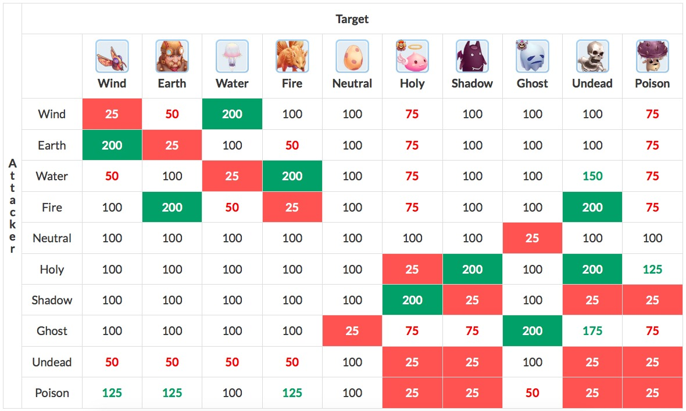

## Bônus de Comida

[Arquivo PDF](static/files/tabela_bonus_food.pdf)

## Bônus de Atk e MAtk do Livro

[Planilha Google Docs](https://docs.google.com/spreadsheets/d/1qjPiDr23gflMGjh0FPk8SJ2T4WSXCXGnfLFepvGcCm8/edit#gid=0)

## Tabela Elemental

## Penalidade por nível

Quando o nível do monstro é superior:
| Diferença de Nível | Exp e Drop Rate |
| :--: | :--: |
| 0–10 | 100% |
| 11–20 | 80% |
| 21+ | 60% |

Quando o nível do monstro é inferior:
| Diferença de Nível | Exp e Drop Rate |
| :--: | :--: |
| 0–10 | 100% |
| 11–15 | 80% |
| 16-20 | 60% |
| 21-25 | 40% |
| 26-30 | 20% |
| 31+ | 10% |
